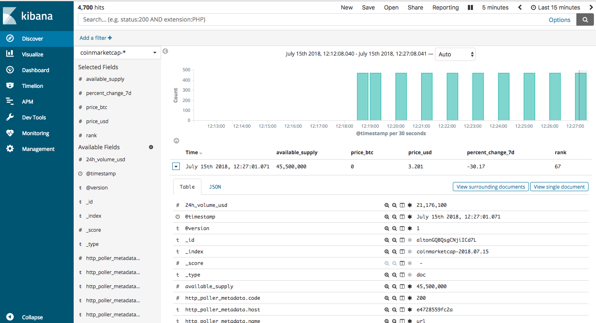

# Guideline how to set up a ELK at localhost


## Prerequisites

- **Docker**

	Install [Docker](https://docker.com/)

- **A minimum of 4GB RAM assigned to Docker**

	Elasticsearch alone needs at least 2GB of RAM to run.


## Installation

	$ docker run -p 5601:5601 -p 9200:9200 -p 5044:5044 --name elk -d sebp/elk

 **Note** – The whole ELK stack will be started.

This command publishes the following ports, which are needed for proper operation of the ELK stack:

- http://localhost:5601 (Kibana web interface).
- http://localhost:9200 (Elasticsearch JSON interface).

## Start Logstash to consume Stdin log:

	$ docker exec -it elk /bin/bash

At the prompt, enter:

	$ /opt/logstash/bin/logstash --path.data /tmp/logstash/data \
		-e 'input { stdin { } } output { elasticsearch { hosts => ["localhost"] } }'

  **Note** – You can create as many entries as you want. Use `^C` to go back to the bash prompt.

If you browse to `http://localhost:9200/_search?pretty`

	{
	  ...
	  "hits": {
	    ...
	    "hits": [ {
	      "_index": "logstash-...",
	      "_type": "logs",
	      ...
	      "_source": { "message": "this is a dummy entry", "@version": "1", "@timestamp": ... }
	    } ]
	  }
	}

You can now browse to Kibana's web interface at `http://localhost:5601`

## Start Logstash to consume Binance ticker API

*  Copy `binance.conf` content by create a new file then run this command:
```
  $ /opt/logstash/bin/logstash --path.data /tmp/logstash/data -f binance.conf
```

## Start Logstash to consume Coinmarketcap ticker API

*  Copy `coinmarketcap.conf` content by create a new file then run this command:
```
  $ /opt/logstash/bin/logstash --path.data /tmp/logstash/data -f coinmarketcap.conf
```

## Result:

   

## Reference:

* https://github.com/spujadas/elk-docker/blob/master/docs/index.md
* https://logz.io/blog/cryptocurrency-tracking-elk-stack/
